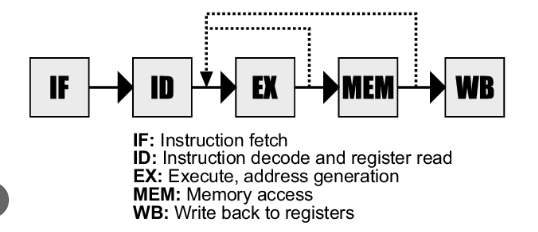
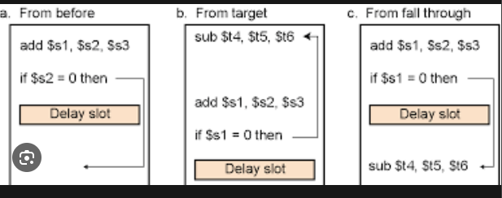
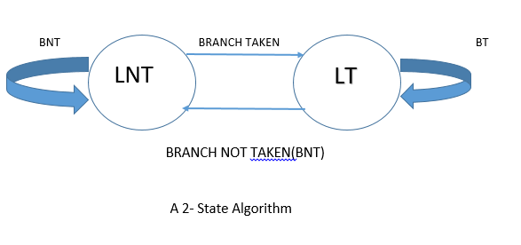
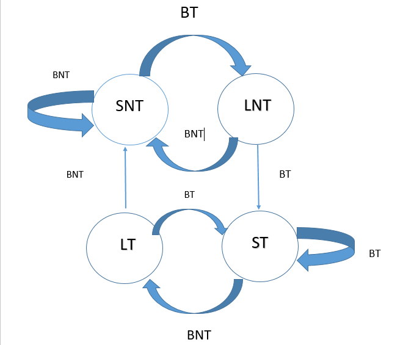
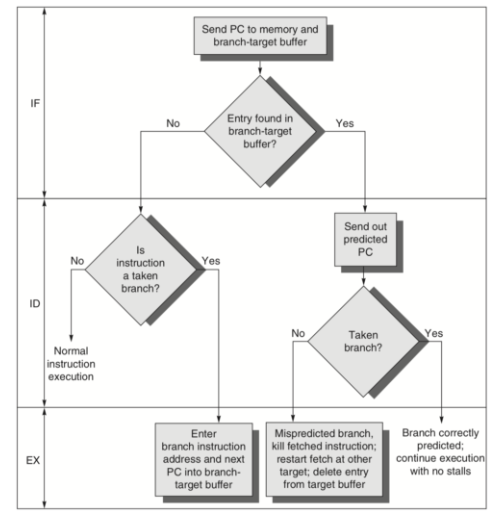

                 **BRANCH HAZARD**

Branch hazards may occur due to the delay between the branch instruction and the actual change in the program counter in a five-stage pipeline in the computer organization, commonly known as the classic RISC pipeline. This is how it's usually done:

1. **Fetch Stage (IF):** The instruction at the current PC is fetched.
2. **Decode Stage (ID):** The instruction is decoded, and if it's a branch instruction, the target address is calculated based on the branch condition.
3. **Execution Stage (EX):** The branch condition is evaluated.
4. **Memory Stage (MEM):** No action related to branches in this stage.
5. **Write Back Stage (WB):** No action related to branches in this stage.

The pipeline must be delayed if a branch instruction is encountered because the next command to be fetched depends on the branch's condition, which has been determined at an execution stage. This delay may result in inefficiencies and is referred to as a branch hazard.

The handling of branch hazards can be done in several ways:

   **1.Stall the Pipeline:** Freeze the pipeline until the branch is resolved. This reduces performance but ensures correct execution.

   **2.Predictive Branching:**
   - **Static Branch Prediction:** The hardware makes a static guess about whether the branch will be taken or not taken. The simplest static branch prediction strategy is to always guess that the branch will not be taken.
   - **Dynamic Branch Prediction:** This scheme uses run-time information to make a prediction. Past behavior of the branch is used to predict its future behavior. If the prediction is incorrect, the pipeline is flushed, and correct instructions are fetched.

   **3.Delayed Branch:** Execute one or more instructions after the branch instruction, assuming the branch will not be taken. If the branch is taken, these instructions are discarded.

   **4.Branch Target Buffer (BTB):** A cache that stores the target addresses of recently executed branches, reducing the delay in fetching the next instruction after a branch.

Example:

1. **INSTRUCTION 1:** Beq R1, R2, 20
2. **INSTRUCTION 2:** AND R2, R3, R4
3. **INSTRUCTION 3:** OR R1, R4, R5
4. **INSTRUCTION 4:** ADD R6, R3, R4

**CASE 1: R1 not equal to R2**

| INST/CLOCK CYCLE | 1 | 2 | 3 | 4 | 5 | 6 | 7 | 8 |
|------------------|---|---|---|---|---|---|---|---|
| INST 1           | F | D | E | M | W |   |   |   |
| INST 2           |   | F | D | E | M | W |   |   |
| INST 3           |   |   | F | D | E | M | W |   |
| INST 4           |   |   |   | F | D | E | W | M |

Since the branch instruction is false, it will not fetch the target address, and it continues to execute the successive instruction. Hence, there will be no branch hazard.

**CASE 2: R1 equal to R2**

| INST/CLOCK CYCLE | 1 | 2 | 3 | 4 | 5 | 6 | 7 | 8 |
|------------------|---|---|---|---|---|---|---|---|
| INST 1           | F | D | E | M | W |   |   |   |
| INST 2           |   | F | D | E | M | W |   |   |
| INST 3           |   |   | F | D |   |   |   |   |
| INST 4           |   |   |   |   |   |   |   |   |

Since the branch instruction is true, it fetches the target address and causes a branch penalty of 2 clock cycles. To overcome this, we can move the comparator and target address finder from the compute stage to the decode stage. This results in the reduction of clock cycles from 2 to 1.

**AFTER MOVING COMPARATOR TO DECODE STAGE:**

| INST/CLOCK CYCLE | 1 | 2 | 3 | 4 | 5 | 6 | 7 | 8 |
|------------------|---|---|---|---|---|---|---|---|
| INST 1           | F | D | E | M | W |   |   |   |
| INST 2           |   | F | D | E | M | W |   |   |
| INST 3           |   |   | F | D |   |   |   |   |
| INST 4           |   |   |   |   |   |   |   |   |

**BRANCH DELAY SLOT:**

The location that follows a branch instruction is called the branch delay slot. The instruction that follows the branch instruction is always executed. Instead of having the instruction that is going to be discarded in the branch delay slot, we can have the instruction that is necessarily executed. Let us understand with an example.

**EXAMPLE:**

- Original sequence:

     Add R7, R8, R9

    Branch_if_[R3]=0 TARGET

    I j + 1

    ...

    TARGET: I k

- After having add instruction in delay slot:

    Branch_if_[R3]=0 TARGET

    Add R7, R8, R9  
                 <!-- BRANCH DELAY SLOT -->
    I j + 1

    ...

    TARGET: I k

**BRANCH PREDICTION:**

**STATIC PREDICTION:**

The simplest form of branch prediction is to assume that the branch will not be taken and to fetch the next instruction in sequential address order. If the prediction is correct, the fetched instruction is allowed to complete and there is no penalty. However, if it is determined that the branch is to be taken, the instruction that has been fetched is discarded, and the correct branch target instruction is fetched. Misprediction incurs the full branch penalty. This simple approach is a form of static branch prediction.

**DYNAMIC BRANCH PREDICTION:**

To improve prediction accuracy further, we can use actual branch behavior to influence the prediction, resulting in dynamic branch prediction. In its simplest form, a dynamic prediction algorithm can use the result of the most recent execution of a branch instruction. The processor assumes that the next time the instruction is executed, the branch decision is likely to be the same as the last time. Hence, the algorithm may be described by the two-state machine. The two states are:

- LT - Branch is likely to be taken
- LNT - Branch is likely not to be taken

- ST: Strongly likely to be taken
- LT: Likely to be taken
- LNT: Likely not to be taken
- SNT: Strongly likely not to be taken

**BRANCH TARGET BUFFER:**

The processor needs to keep more information about the history of execution. The required information is usually stored in a small, fast memory called the branch target buffer. The branch target buffer identifies branch instructions by their addresses. As each branch instruction is executed, the processor records the address of the instruction and the outcome of the branch decision in the buffer. The information is organized in the form of a lookup table, in which each entry includes:

- the address of the branch instruction
- one or two state bits for the branch prediction algorithm
- the branch target address

Large programs have many branch instructions. A branch target buffer with enough storage to accommodate information for all of them would be large, and searching it quickly would be difficult. For this reason, the table has a limited size, containing information for only the most recently executed branch instructions. Entries in the table are replaced as other branch instructions are executed. Typically, the table contains on the order of 1024 entries.

**CONCLUSION:**

Brand hazard is a critical issue that can significantly impact a company's reputation and bottom line. It arises from various factors such as product quality issues, unethical business practices, or negative publicity. Managing brand hazard requires proactive measures such as maintaining high-quality standards, transparent communication, and swift action to address any issues that arise. Failure to effectively manage brand hazard can lead to loss of customer trust, damaged brand image, and ultimately, financial losses for the company.

